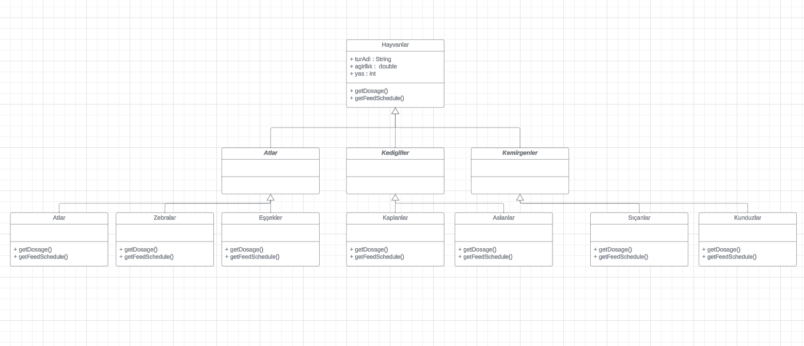

# Patika OOP (Object Oriented Programming) Dersi Hayvanat Bahçesi Yönetim Sistemi UML Diyagram Projesi

Hayvanat Bahçesi Yönetim Sistemi UML Diyagram Projesinin Linki

[Proje Diyagramına Git](https://lucid.app/lucidchart/bd5fe98d-c5fc-4ce6-934e-9ca55a2c7b85/edit?viewport_loc=-2269%2C-644%2C3048%2C1410%2C0_0&invitationId=inv_a6ec8594-cef4-492a-8397-83260d4c59a1)

Proje Diyagramı Görselleri

